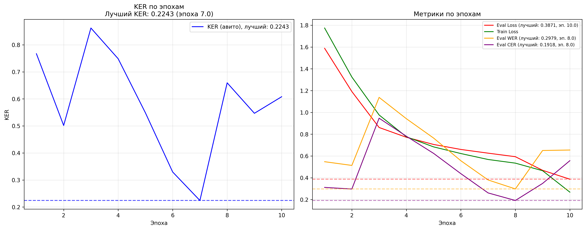

# Адаптация Whisper к конкретному слову

## Описание

Попытки научить `openai/whisper-small` корректно распознавать и транскрибировать специфическое ключевое слово "авито", которое может отсутствовать в оригинальном обучающем наборе данных модели.

Исследуются подходы как с применением transfer learning, так и без.

## Структура проекта

```
.
│
│
├── clips/                  # Датасет (в репозиторий не опубликован)   
│                             
├── create_dataset/         # Скрипты для сборки датасета с YouTube
│   └── ... 
│                          
├── without_finetune/       # Эксперименты БЕЗ дообучения
│   │ 
│   ├── approach_results/   # Результаты для каждого подхода - исходный dataset.csv + колонка pred
│   │    |                  # и txt со средним KER по всем записям датасета
│   │    │    
│   │    ├─── wf_approach_1.csv
│   │    ├─── wf_approach_2.csv
│   │    ├─── wf_approach_3.csv
│   │    ├─── wf_approach_4.csv
│   │    |
│   │    ├─── wf_approach_1.txt
│   │    ├─── wf_approach_2.txt
│   │    ├─── wf_approach_3.txt
│   │    └─── wf_approach_4.txt
│   │
│   ├── samples/ # Тестовые аудио (сейчас только hello_avito.wav)
│   │    
│   ├── base_checkpoint/                   # Общий чекпоинт модели для подходов 
│   │                                      # без дообучения (веса + конфиги processor-а)
│   │
│   ├── approach_1_base/                   # Реализация базового подхода (обычная модель)
│   │   │ 
│   │   ├── expreriment_1_base.py          # Эксперимент с базовой моделью
│   │   └── inference_base.py              # Инференс
│   │
│   ├── approach_2_prompt/                 # Реализация подхода с промптом
│   │   │
│   │   ├── experiment_2_prompt.py         # Эксперимент с промптом
│   │   └── inference_prompt.py            # Инференс
│   │
│   ├── approach_3_suppress/               # Реализация подхода с подавлением токенов
│   │   │
│   │   ├── experiment_3_suppress.py       # Эксперимент с подавлением токенов
│   │   └── inference_suppress.py          # Инференс
│   │
│   ├── approach_4_combined/               # Реализация подхода-комбинации методов
│   │   │
│   │   ├── experiment_4_combined.py       # Эксперимент с комбинированным подходом
│   │   └── inference_combined.py          # Инференс
│   .
│     
│   
├── lora/                # Реализация LoRA
│   │
│   ├── lora_metrics/    # Результаты для LoRA
│   │    │   
│   │    ├─── all_metrics.txt         # Метрики по всему датасету
│   │    ├─── test_metrics.txt        # Метрики по тестовой выборке
│   │    ├─── all_predictions.csv     # Предсказания по всему датасету
│   │    ├─── test_predictions.csv    # Предсказания по тестовой выборке
│   │    └─── metrics_plot.png        # График метрик по эпохам
│   │       
│   │      
│   ├── approach_5_lora/              # Реализация модели после дообучения LoRA
│   │    │
│   │    ├── lora_checkpoint/         # Чекпоинт модели
|   │    └── inference_lora.py        # Инференс
│   │
|   │
│   └── lora_train/                   # Папка со скриптом для дообучения LoRA
│        │
│        ├── train_lora.py            # Скрипт для дообучения LoRA
│        └── RIRS_NOISES/             # Аудио для аугментации датасета (в репозиторий не опубликован)
|
├── README.md                    # README
├── requirements-inf.txt         # Зависимости для инференса
├── requirements-train.txt       # Зависимости для повторного обучения LoRA
|
.
```

## Настройка и запуск

### Требования

*   Python 3.12.3

### Установка

1.  **Создайте и активируйте виртуальное окружение**:

    ```bash
    python -m venv venv

    # Для Linux/macOS:
    source venv/bin/activate

    # Для Windows:
    venv\Scripts\activate.bat
    ```
2.  **Установите зависимости**:

    ```bash
    pip install -r requirements-inf.txt         # Для инференса
    pip install -r requirements-train.txt       # Для дообучения LoRA
    ```

### Запуск инференсов моделей

Чекпоинт у моделей без дообучения общий, но в каждой папке с подходом есть свой файл 
`inference.py`, который запускает инференс с использованием конкретного подхода.

У каждого подхода есть папка с названием `/approach_X_<name>/`, где `X` - номер подхода, а `<name>` - его название.

В каждой папке такой папке есть сохраненный чекпоинт модели (веса + конфиги processor-а) и файл `inference.py`, который запускает инференс для данного подхода.

Инференс - функция `transcribe` в файле `inference.py`, которая принимает на вход аудиофайл, частоту сэмплирования и возвращает транскрипцию.

Достаточно подставить в файле путь к аудиофайлу, который вы хотите протестировать.

## Этапы

### Подготовка датасета (`create_dataset/`)

На этом этапе собирается датасет с аудиофайлами, содержащими слово "авито".

Для этого был написан парсер видео с YouTube, содержащих слово "авито". Аудио из этого видео разделяется на небольшие фрагменты (до 30 секунд), которые транскрибируются (из субтитров) и сохраняются в `clips/`.

Таким образом было собрано 1000+ аудиофайлов, содержащих слово "авито" в различных контекстах.

### Эксперименты без дообучения (`without_finetune/`)

Цель - улучшить распознавание "авито" без изменения весов модели, используя различные "подсказки".

#### 1. Базовая модель

*   **Описание**: Используется стандартная модель `openai/whisper-small` без каких-либо модификаций. Служит точкой отсчета для сравнения с другими подходами.

*   **KER (на всем датасете)**: 0.7683

#### 2. Использование initial prompt

*   **Описание**: Модели перед транскрипцией передается текстовый промпт. Промпт содержит слово "авито" в различных контекстах, чтобы "настроить" модель на его ожидание и корректное написание.
    *   Пример текста промпта:
        ```python
        initial_prompt = (
            'компания авито, авито это сайт для объявлений, звонил продавцу с авито, '
            'купили на авито, продают на авито, сайт авито, товар на авито, '
            'купил с авито, работа на авито, заказал с авито, одежда с авито'
        )
        ```

*   **KER (на всем датасете)**: 0.4231

#### 3. Подавление неверных токенов - supress tokens

Подсмотрено тут - https://discuss.huggingface.co/t/adding-custom-vocabularies-on-whisper/29311/5

*   **Описание**: Определяется список часто встречающихся ошибочных транскрипций слова "авито" (например, "авита", "овито", "вито", "вид то"). Для тех из них, что токенизируются в один уникальный токен, ID этого токена добавляется в список `suppress_tokens` в конфигурации генерации. Это заставляет модель избегать генерации данных конкретных неверных токенов.

* **Реализация**

Набор неверных слов токенизируется, и для каждого токена определяется его ID. Эти ID добавляются в `suppress_tokens` в конфигурации генерации.

При этом проверяется, что эти токены не содержатся в токензированном слове "авито", чтобы не подавлять его.

* **Набор неверных транскрипций**:
    ```python
        wrong_transcriptions = [
            "авита", "овито", "авиту", "авитто", "овита", "авида", "авиды",
            "Avita", "AVITA", "AviTa", "AVITA.", "Avid", "A Vito", "A-WIT",
            "AVID", "Avida", 'Aveda', 'Aevit', 'A vita', 'A Witte', 'A вито',
            'A ВИТА', 'A вито'
        ]
    ```

*   **KER (на всем датасете)**: 0.7059

#### 4. Комбинированный подход

*   **Описание**: Одновременное применение двух предыдущих техник: использование текстового промпта и подавление неверных токенов. Также добавляется beam search с `num_beams=5`.

*   **KER (на всем датасете)**: 0.5108

#### 5*. Работа с токенизатором, словарем и merges правилами

*   **Описание**: 

Данного подхода тут не будет, так как он не сработал, но на него было потрачено много сил, поэтому хотелось бы узнать, возможно ли было с помощью него добиться результата?

Просто брал токены, которые встречаются в ошибочной генерации слова "авито",
например "av", "vita", ...  и заменял их принудительно на "ав" и "вито" соответственно.

При этом также менял merges правила, подгоняя под эти токены.

Либо я запутался, либо действительно пытался сделать невозможное.


### LoRA (`lora/`)

*   **Описание**: Использование техники Parameter-Efficient Fine-Tuning (PEFT), конкретно LoRA, для дообучения `openai/whisper-small` на собранном датасете (`clips/dataset.csv`). Цель - адаптировать веса модели для более надежного распознавания "авито".

Дообучение выполнялось 10 эпох. Лучшая эпоха была выбрана по метрике KER (Keyword Error Rate) для слова "авито" - это 7 эпоха.

Также были использованы аугментации аудио из датасета [Room Impulse Response and Noise Database](https://www.openslr.org/28), чтобы улучшить устойчивость модели к шуму и различным акустическим условиям.

Аугментации увеличили датасет до **2000+ аудиофайлов** и значительно улучшили качество распознавания.

#### Результаты обучения

**Метрики на всем датасете:**
| Метрика | Значение |
|---------|----------|
| KER (для слова "авито") | `0.1430` |
| WER (Word Error Rate) | `0.2412` |
| CER (Character Error Rate) | `0.1458` |

**Метрики на тестовой выборке:**
| Метрика | Значение |
|---------|----------|
| KER (для слова "авито") | `0.2190` |
| WER (Word Error Rate) | `0.2878` |
| CER (Character Error Rate) | `0.1762` |

#### Визуализация результатов


#### Параметры обучения LoRA

```python
TrainingArguments(
    per_device_train_batch_size=8,
    per_device_eval_batch_size=4,
    gradient_accumulation_steps=4,
    learning_rate=5e-5,
    lr_scheduler_type='cosine',
    lr_scheduler_kwargs={'num_cycles': 0.5},
    weight_decay=0.01,
    warmup_steps=500,
    num_train_epochs=10,
    fp16=True,
    metric_for_best_model='eval_ker',
    greater_is_better=False,
    ...
)
```

## Сравнение результатов

| Подход                    | KER (датасет, avg)   | 
| :------------------------ | :------------------: | 
| 1: Base                   | 0.7683               | 
| 2: Prompt                 | 0.4231               |
| 3: Suppress Tokens        | 0.7059               |
| 4: Combined + Beam Search | 0.5108               |
| 5: LoRA                   | 0.1430               | 

*   **KER (Keyword Error Rate)**: Рассчитывается только по ключевому слову "авито" с использованием `jiwer`. Меньше - лучше.

## Выводы

Наилучший результат достигается при использовании LoRA, которая позволяет адаптировать модель к специфическому слову "авито" с минимальными изменениями весов.

Если выбирать подход без дообучения, то наиболее эффективным является подход с заданием текстового промпта, который значительно улучшает качество распознавания по сравнению с базовой моделью.

Остальные подходы показали себя гораздо хуже, как в сложности реализации, так и в качестве распознавания.

Также стоит отметить опасность подхода с подавлением токенов, в погоне за идеальным KER по слову "авито" гарантировано ухудшение качества распознавания других слов, что может быть критично в реальных приложениях.

---

Это задание явлвяется домашней работой для курса "ML Advanced" от Академии Аналитиков Авито